# GeekMagic Display for Home Assistant

[](https://github.com/hacs/integration)

A Home Assistant custom integration for GeekMagic displays (SmallTV Pro and similar ESP8266-based devices).

## Dashboard Samples

<p align="center">
  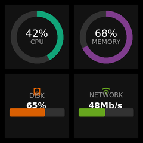
  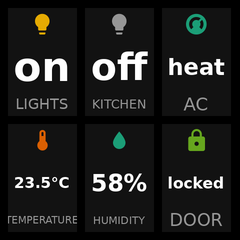
  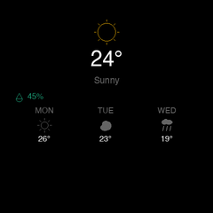
  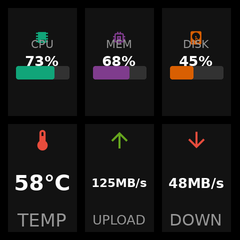
</p>

<p align="center">
  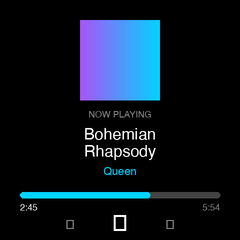
  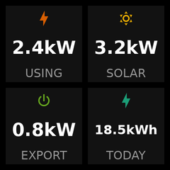
  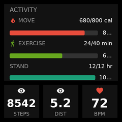
  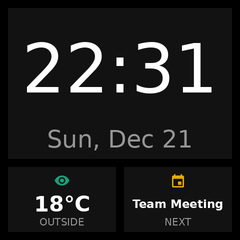
</p>

<p align="center">
  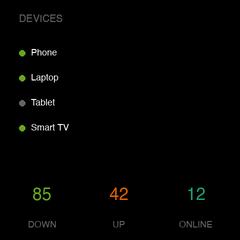
  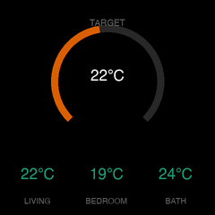
  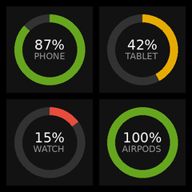
  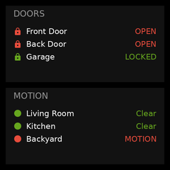
</p>

## Widget Gallery

| Widget | 1x1 | 1x2 | 2x1 | 2x2 | 2x3 | 3x3 |
|--------|-----|-----|-----|-----|-----|-----|
| **Gauge (Bar)** |  | 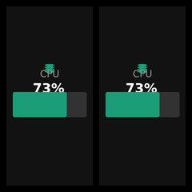 | 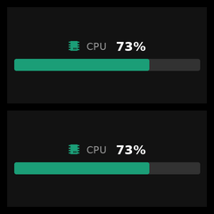 | 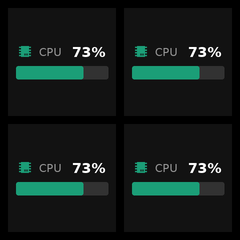 | 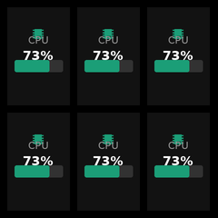 | 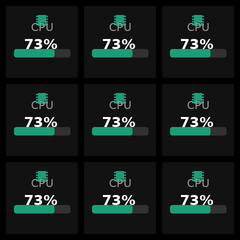 |
| **Gauge (Ring)** | 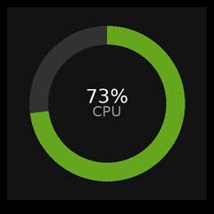 | 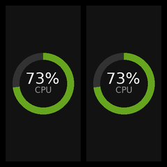 | 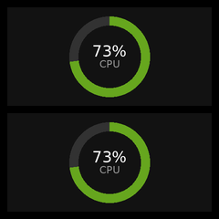 | 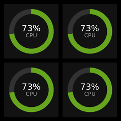 | 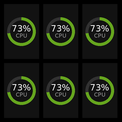 | 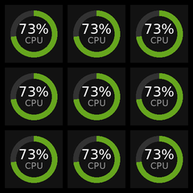 |
| **Gauge (Arc)** | 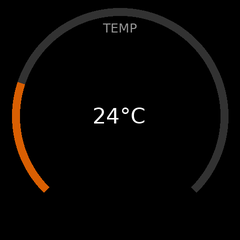 | 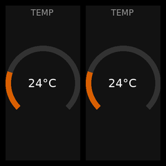 | 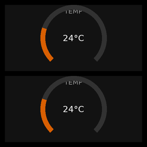 | 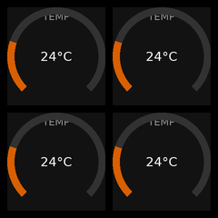 | 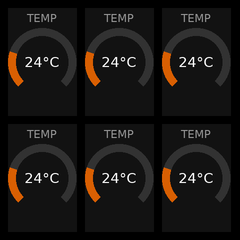 | 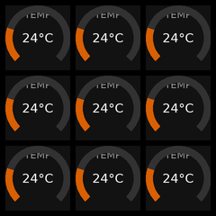 |
| **Entity (Icon)** | 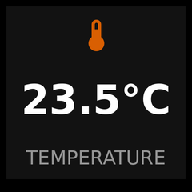 | 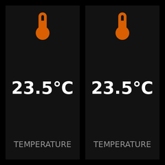 | 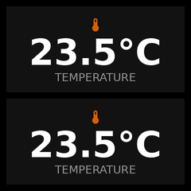 | 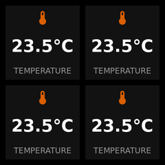 | 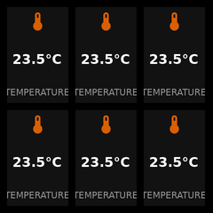 | 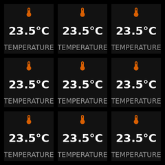 |
| **Entity (Plain)** | 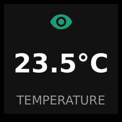 | 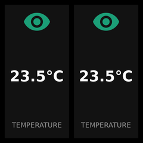 | 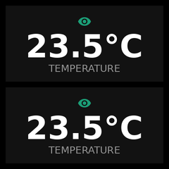 | 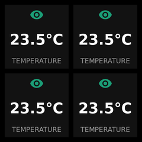 | 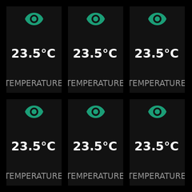 | 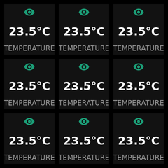 |
| **Clock** | 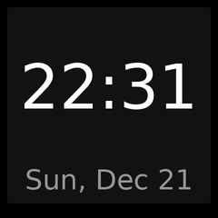 | 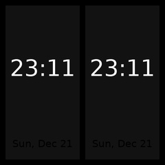 | 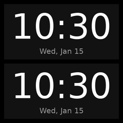 | 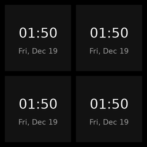 | 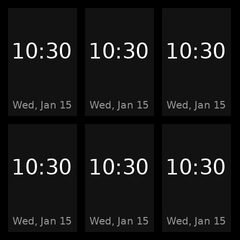 | 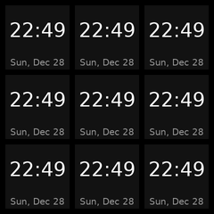 |
| **Text** |  |  | 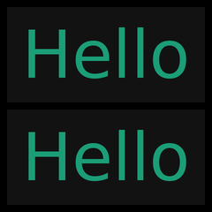 |  | 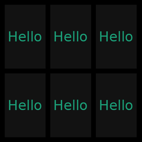 | 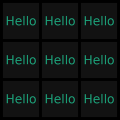 |
| **Progress** |  |  |  |  |  |  |
| **Weather** |  |  |  |  |  |  |
| **Status** |  |  |  |  |  |  |
| **Chart** |  |  |  |  |  |  |

## Layout Examples

<p align="center">
  
  
  
  
  
</p>

## Themes

Choose from 5 built-in themes that go beyond just colors - affecting typography, spacing, shapes, and visual effects.

| Classic | Minimal | Neon | Retro | Soft |
|:-------:|:-------:|:----:|:-----:|:----:|
|  |  |  |  |  |
| Balanced dark theme with rounded corners | Sharp, compact, thin borders | Cyberpunk with thick borders | Terminal-style with scanlines | Very rounded, muted colors |

---

## Features

- **12 widget types**: Clock, entity, media, chart, text, gauge, progress, weather, status, camera, and more
- **6 layout options**: Grid (2x2, 2x3, 3x2), hero, split, three-column
- **5 visual themes**: Classic, Minimal, Neon, Retro, Soft - affecting colors, spacing, corners, and effects
- **Entity-based configuration**: Configure via Home Assistant entities (WLED-style)
- **Multi-screen support**: Up to 10 screens with auto-cycling
- **Pure Python rendering**: Uses Pillow for image generation (no browser required)
- **Configurable refresh**: Updates every 5-300 seconds

## Installation

### HACS (Recommended)

1. Open HACS in Home Assistant
2. Click "Custom repositories"
3. Add this repository URL
4. Install "GeekMagic Display"
5. Restart Home Assistant

### Manual

1. Copy `custom_components/geekmagic` to your Home Assistant's `custom_components` folder
2. Restart Home Assistant

## Configuration

1. Go to **Settings** → **Devices & Services**
2. Click **Add Integration**
3. Search for "GeekMagic"
4. Enter your device's IP address

After adding the integration, your device will display a welcome screen until you configure a dashboard:

<p align="center">
  
</p>

---

## Widget Types

| Type | Description |
|------|-------------|
| `gauge` | Bar, ring, or arc gauge (`style: bar/ring/arc`) |
| `entity` | Any HA entity value (with optional `icon`) |
| `clock` | Time and date |
| `text` | Static or dynamic text |
| `progress` | Goal tracking with progress bar |
| `weather` | Weather with forecast |
| `status` | Binary sensor indicator |
| `chart` | Sparkline from entity history |
| `camera` | Camera snapshot display |
| `media` | Now playing from media player |
| `multi_progress` | Multiple progress items |
| `status_list` | Multiple status indicators |

## Layout Types

| Layout | Slots | Description |
|--------|-------|-------------|
| `grid_2x2` | 4 | 2x2 grid of equal widgets |
| `grid_2x3` | 6 | 2 rows, 3 columns |
| `hero` | 4 | Large hero + 3 footer widgets |
| `split` | 2 | Left/right or top/bottom panels |
| `three_column` | 3 | 3 vertical columns |

---

## Entity-Based Configuration

GeekMagic uses **entity-based configuration** similar to WLED. Configure your display directly through Home Assistant entities on the device page.

### Device Entities

| Entity | Type | Description |
|--------|------|-------------|
| `number.xxx_brightness` | Number | Display brightness (0-100) |
| `number.xxx_refresh_interval` | Number | Update interval in seconds (5-300) |
| `number.xxx_screen_count` | Number | Number of screens (1-10) |
| `select.xxx_current_screen` | Select | Active screen selector |
| `button.xxx_refresh_now` | Button | Force immediate display update |
| `button.xxx_next_screen` | Button | Switch to next screen |
| `sensor.xxx_status` | Sensor | Connection status |

### Per-Screen Entities

| Entity | Description |
|--------|-------------|
| `text.xxx_screen_N_name` | Screen name |
| `select.xxx_screen_N_layout` | Layout type |
| `select.xxx_screen_N_theme` | Visual theme (Classic, Minimal, Neon, Retro, Soft) |
| `select.xxx_screen_N_slot_M_widget` | Widget type for slot M |
| `text.xxx_screen_N_slot_M_entity` | Entity ID for slot M |
| `text.xxx_screen_N_slot_M_label` | Custom label for slot M |

---

## Services

| Service | Description |
|---------|-------------|
| `geekmagic.refresh` | Force immediate display update |
| `geekmagic.brightness` | Set display brightness (0-100) |
| `geekmagic.set_screen` | Switch to a specific screen by index |
| `geekmagic.next_screen` | Switch to the next screen |
| `geekmagic.previous_screen` | Switch to the previous screen |

## Device Compatibility

Tested with:
- GeekMagic SmallTV Pro (240x240, ESP8266)

Should work with any GeekMagic device that supports the `/doUpload` HTTP API.

## Development

```bash
uv sync                              # Install dependencies
uv run pytest                        # Run tests
uv run ruff check .                  # Lint
uv run pre-commit run --all-files    # Run all checks
uv run python scripts/generate_samples.py  # Generate samples
```

## License

MIT
